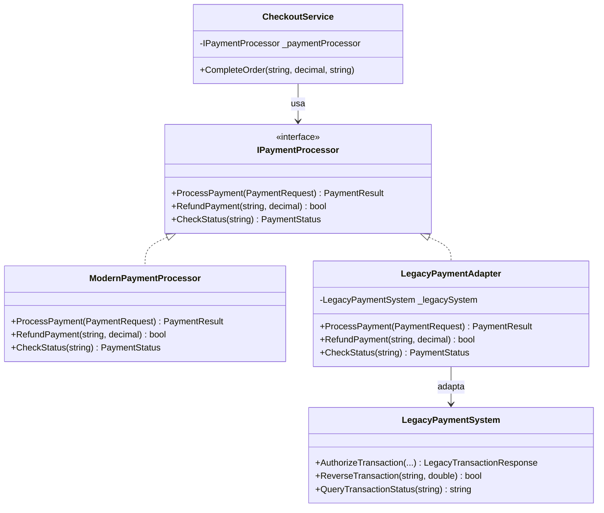

## 🥁 CarnaCode 2026 - Desafio 06 - Adapter

Oi, eu sou o Ronaldo e este é o espaço onde compartilho minha jornada de aprendizado durante o desafio **CarnaCode 2026**, realizado pelo [balta.io](https://balta.io). 👻

Aqui você vai encontrar projetos, exercícios e códigos que estou desenvolvendo durante o desafio. O objetivo é colocar a mão na massa, testar ideias e registrar minha evolução no mundo da tecnologia.

### Sobre este desafio
No desafio **Adapter** eu tive que resolver um problema real implementando o **Design Pattern** em questão.
Neste processo eu aprendi:
* ✅ Boas Práticas de Software
* ✅ Código Limpo
* ✅ SOLID
* ✅ Design Patterns (Padrões de Projeto)

## Problema
Um e-commerce moderno precisa integrar com um sistema legado de processamento de pagamentos que usa interfaces e estruturas de dados incompatíveis com o sistema atual.
O código atual não consegue usar o sistema legado sem grandes mudanças na aplicação.

## Padrão de Projeto: Adapter

O **Adapter** é um padrão estrutural que permite que objetos com interfaces incompatíveis trabalhem juntos. Ele funciona como um "tradutor" — não modifica nenhum dos dois lados, apenas converte a comunicação entre eles.

Neste projeto, o `LegacyPaymentAdapter` traduz as chamadas da interface moderna (`IPaymentProcessor`) para o formato esperado pelo sistema legado (`LegacyPaymentSystem`), encapsulando todas as conversões de tipos.

## Diagrama de Classes



## Estrutura do Projeto

```
src/
├── Adapters/
│   └── LegacyPaymentAdapter.cs    # Adapter (peça central do padrão)
├── Interfaces/
│   └── IPaymentProcessor.cs       # Interface moderna
├── Legacy/
│   ├── LegacyPaymentSystem.cs     # Sistema legado (não modificado)
│   └── LegacyTransactionResponse.cs
├── Models/
│   ├── PaymentRequest.cs
│   ├── PaymentResult.cs
│   └── PaymentStatus.cs
├── Processors/
│   └── ModernPaymentProcessor.cs  # Implementação moderna
├── Services/
│   └── CheckoutService.cs         # Serviço de checkout (não modificado)
├── Challenge.cs                   # Problema original (excluído da compilação)
├── Program.cs                     # Ponto de entrada com a solução
└── DesignPatternChallenge.csproj
```

## Etapas da Refatoração

| Etapa | Ação | Arquivos |
|-------|------|----------|
| 1 | Extrair modelos para arquivos próprios | `Models/PaymentRequest.cs`, `PaymentResult.cs`, `PaymentStatus.cs` |
| 2 | Separar interface e implementação moderna | `Interfaces/IPaymentProcessor.cs`, `Processors/ModernPaymentProcessor.cs` |
| 3 | Separar classes do sistema legado | `Legacy/LegacyPaymentSystem.cs`, `LegacyTransactionResponse.cs` |
| 4 | Criar o Adapter (peça central) | `Adapters/LegacyPaymentAdapter.cs` |
| 5 | Criar serviço e novo ponto de entrada | `Services/CheckoutService.cs`, `Program.cs` |

> O arquivo `Challenge.cs` foi mantido intacto como referência do problema original e excluído da compilação via `.csproj`.


## Sobre o CarnaCode 2026
O desafio **CarnaCode 2026** consiste em implementar todos os 23 padrões de projeto (Design Patterns) em cenários reais. Durante os 23 desafios desta jornada, os participantes são submetidos ao aprendizado e prática na idetinficação de códigos não escaláveis e na solução de problemas utilizando padrões de mercado.

### eBook - Fundamentos dos Design Patterns
Minha principal fonte de conhecimento durante o desafio foi o eBook gratuito [Fundamentos dos Design Patterns](https://lp.balta.io/ebook-fundamentos-design-patterns).

### Veja meu progresso no desafio
[Repositório Central](https://github.com/ronaldofas/balta-desafio-carnacode-2026-central)
